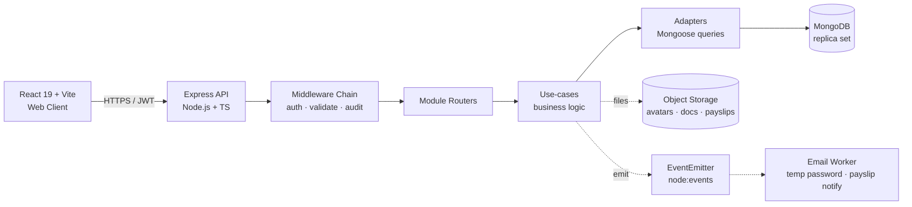
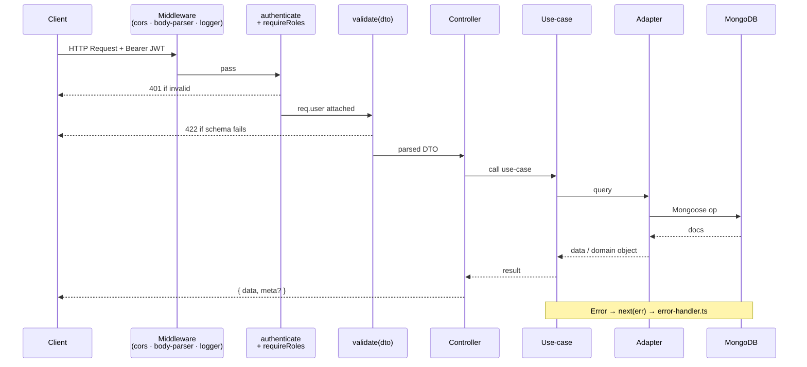
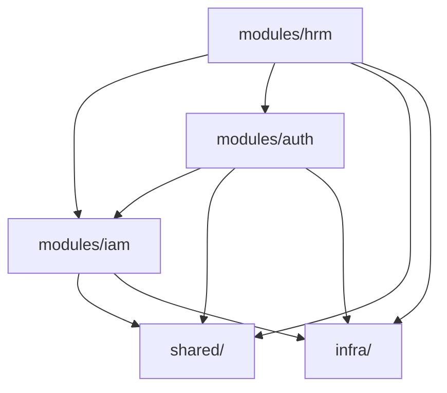

# Soosky HRM — Backend Architecture

> **Stack:** Node.js · TypeScript · Express · Mongoose · MongoDB
> **Style:** Modular monolith — `modules/{auth,iam,hrm}` over a shared `infra`/`shared` base
> **Related:** [DATABASE.md](./DATABASE.md), [CONVENTIONS.md](./CONVENTIONS.md)

---

## 1. System Overview



**Rationale for the module layout:**

- Each module = one business capability with its own core, adapters and schemas.
- Inside a module, `core/` is framework-free and `adapters/` hold everything that
  touches Express, Mongoose or S3 — so the business rules stay testable in isolation.
- Cross-module coupling goes through `index.ts` only, and is enforced by ESLint.
- `iam` depends on nothing, so it can serve a second product without being forked.

**System components:**

- **Client:** React 19 (Vite) — talks to API over HTTPS with JWT bearer tokens.
- **API:** single Express process; horizontally scalable behind a load balancer.
- **Database:** MongoDB replica set (required for multi-document transactions used in account provisioning, payroll computation, leave approval).
- **Object storage:** S3-compatible bucket for `employeeDocuments.fileUrl`, `payslips.fileUrl`, `employeeProfiles.avatarUrl`.
- **Async work:** in-process `EventEmitter` for v1 (email, notifications); a message broker can be swapped in later without changing emitters.

---

## 2. Folder Structure

```
src/
├── server.ts                     # Bootstrap: connect DB, register listeners/jobs, start HTTP
├── infra/                        # Application-wide infrastructure
│   ├── config.ts                 # Zod-validated process.env
│   ├── jwt.config.ts             # JWT secrets, issuer/audience, TTLs
│   ├── db/mongoose.ts            # connect/disconnect lifecycle
│   ├── logger/logger.ts          # Pino root logger
│   ├── events/event-bus.ts       # Typed EventEmitter wrapper
│   ├── mail/                     # SMTP transport + templates
│   └── server/createExpressServer.ts   # Express app factory (testable)
├── shared/                       # Only what 2+ modules use
│   ├── http/                     # authenticate · requireRoles · requirePermission · validate · errorHandler
│   ├── errors/                   # HttpError · NotFoundError · ForbiddenError
│   ├── crypto/hash.util.ts       # bcrypt + token hashing
│   ├── types/                    # AuthPayload · JWT payloads · Response<T> · Paginated<T>
│   ├── utils/pagination.util.ts
│   └── testing/http.ts           # supertest + mongodb-memory-server harness
└── modules/
    ├── auth/                     # "who is this user?"
    ├── iam/                      # "what may this user do?"
    └── hrm/                      # the HR business module
```

Every module has the same three parts:

```
modules/<module>/
├── core/                         # Framework-free: no Express, no Mongoose
│   ├── domain/                   # entities, value objects, pure rules
│   └── app/                      # use-cases + the ports they depend on
├── adapters/                     # Everything that touches the outside world
│   ├── http/                     # routers + controllers
│   ├── persistence/              # Mongoose schemas + repositories/gateways
│   └── container.ts              # composition root: the only place adapters are constructed
└── index.ts                      # the module's public API — nothing else is importable
```

`modules/hrm` keeps its HR sub-domains as folders inside `core/`, not as separate
modules:

```
modules/hrm/
├── core/{employee,attendance,payroll,performance,organization,
│         settings,period,dashboard,notification,storage}/
│        └── {domain,app,dto}/
├── adapters/
│   ├── http/<sub-domain>/            # controllers + routes
│   ├── persistence/mongoose/
│   │   ├── models/                   # one file per HR collection
│   │   └── <sub-domain>/             # repositories + gateways
│   ├── services/<sub-domain>.services.ts   # clock, audit, event-bus, unit-of-work adapters
│   ├── files/                        # employee CSV / XLSX import + export
│   ├── object-storage/s3.gateway.ts
│   ├── jobs/ · listeners/
│   └── container/<sub-domain>.ts
├── tests/<sub-domain>/
└── index.ts
```

---

## 3. Module Anatomy

> **Note:** Mongoose schemas live in the module that owns the data —
> `modules/hrm/adapters/persistence/mongoose/models/` for HR collections,
> `modules/iam/adapters/persistence/models/` for users/roles/permissions/audit,
> `modules/auth/adapters/persistence/models/` for sessions and password-setup
> tokens. There is no global `shared/models`.

### 3.1 `auth` — login, sessions, tokens

```
modules/auth/
├── core/
│   ├── domain/policy.ts                # setup-token TTLs, set-password link
│   └── app/
│       ├── ports/index.ts              # SessionRepository, TokenIssuer, hashers…
│       ├── use-cases/auth.usecases.ts  # login · refresh · logout · change-password · me
│       ├── use-cases/password-setup.usecases.ts
│       └── dto/{login,set-password,change-password}.dto.ts
├── adapters/
│   ├── http/{auth.routes.ts,controllers.ts}
│   ├── persistence/{session,password-setup-token}.repository.ts + models/
│   ├── security/{token.service.ts,services.ts}
│   └── container.ts
├── tests/auth-flow.http.spec.ts
└── index.ts
```

Auth owns sessions and token issuance. It reads users/roles/permissions through
the repositories IAM exposes — they are injected in `adapters/container.ts`, so
Auth never imports an IAM adapter directly.

### 3.2 `iam` — users, roles, permissions, audit

```
modules/iam/
├── core/
│   ├── domain/policy.ts                # account lockout threshold, identifier shape
│   └── app/
│       ├── ports/index.ts
│       ├── use-cases/{user,role,permission,audit}.usecases.ts
│       └── dto/
├── adapters/
│   ├── http/{iam.routes.ts,controllers.ts}
│   ├── persistence/{user,role,permission,audit-log}.repository.ts + models/
│   ├── directory.ts                    # the API other modules use against the identity store
│   ├── services.ts
│   └── container.ts
└── index.ts
```

IAM depends on no other business module. Permissions stay plain RBAC key
strings (`hrm.employee.read`, `hrm.payroll.approve`), so the same module can
serve another product later without change.

### 3.3 `hrm` — the HR business module

Sub-domains under `core/` share one `adapters/` tree, one composition root and
one `index.ts`. A use-case lives in `core/<sub-domain>/app`, the port it needs
in `core/<sub-domain>/domain/ports`, and the Mongoose implementation in
`adapters/persistence/mongoose/<sub-domain>`.

When HRM has to touch an account — provisioning login for a new employee,
renaming the account, deleting it with the employee — it calls `iamDirectory`
from `@modules/iam`, passing its own transaction handle so both writes commit
together.

---

## 4. Request Flow



**Layer responsibilities:**

- **Middleware:** CORS, body parsing, request id, request logging.
- **Auth middlewares:** `authenticate` verifies JWT → attaches `req.user`; `requireRoles` / `requirePermission` gate access.
- **Validation:** `validate(zodSchema, 'body' | 'query' | 'params')` parses & coerces.
- **Controller** (`adapters/http`): HTTP only — extract input, call the use-case, shape the response. No business logic.
- **Use-case** (`core/app`): business rules, orchestrates ports, manages transactions. Never imports Express or Mongoose.
- **Adapter** (`adapters/persistence`): Mongoose queries, aggregations, `.lean()`, `populate`. No HTTP, no business rules.

**Example — Account provisioning (`POST /employees/:id/grant-login`):**

1. `authenticate` validates HR's access token → `req.user`.
2. `requireRoles('admin', 'hr_manager')` checks role.
3. `validate(grantLoginDto, 'body')` parses request body (optional override email).
4. `employeeController.grantLogin` → `accountProvisioningService.grantLogin(employeeId, hrUserId)`.
5. The use-case opens Mongoose `session.withTransaction(...)` and, through its ports:
   - Creates the account via `iamDirectory.createUser` (`mustChangePassword: true`, bcrypt-hashed temp password).
   - Updates `Employee.userId`.
   - Assigns the `employee` role via `iamDirectory.assignRole`.
   - Writes the audit entry via `iamDirectory.writeUserAudit`.
   The transaction handle is passed along, so the HRM and IAM writes commit together.
6. The use-case emits `employee.granted-login` → the listener emails the set-password link.
7. Controller responds `200 { data: { userId, employeeId } }`.

---

## 5. Cross-Module Communication



**Allowed:**

- **Public exports via `index.ts`:** `import { auditService } from '@modules/iam'` — only what a module re-exports is callable.
- **Shared HTTP middleware / utilities** in `src/shared/`, infrastructure singletons in `src/infra/`.
- **Event bus** (`infra/events/event-bus.ts`) for async cross-module reactions:
  - `employee.granted-login` → email the set-password link
  - `payroll.computed` → notify the employee
  - `leave.approved` → adjust `leaveBalances`
  - `employee.changed` → write to `employeeHistories`

**Forbidden:**

- ❌ `import { User } from '@modules/iam/adapters/persistence/models/user.model'` from HRM — reach the identity store through `iamDirectory`.
- ❌ any import of `@modules/hrm` or `@modules/auth` from inside `modules/iam`.
- ❌ `shared/` or `infra/` importing a module's internals.
- ✅ `import { iamDirectory, auditService } from '@modules/iam'`.

These are not conventions on paper: `eslint.config.mjs` enforces each of them
with `no-restricted-imports`, so a violation fails `npm run lint`. Integration
tests are exempt — they assert on persisted state across module boundaries.

**Module dependencies:**

| Module | Depends on   | Reason                                                       |
| ------ | ------------ | ------------------------------------------------------------ |
| `iam`  | —            | Identity store; stays reusable by another product            |
| `auth` | `iam`        | Authenticates against the users/roles IAM owns               |
| `hrm`  | `iam`, `auth` | Provisions accounts, writes audit entries, revokes sessions  |

---

## 6. Shared vs Infra

| `shared/` (request-scoped, used by 2+ modules)                 | `infra/` (application-wide singletons)                  |
| -------------------------------------------------------------- | ------------------------------------------------------- |
| `authenticate`, `requireRoles`, `requirePermission` middleware | `infra/db/mongoose.ts` — connection lifecycle           |
| `validate(zodSchema)` middleware                               | `infra/logger/logger.ts` — Pino root logger             |
| `error-handler` global middleware                              | `infra/events/event-bus.ts` — typed EventEmitter        |
| `HttpError`, `NotFoundError`, `ForbiddenError`                 | `infra/config.ts`, `infra/jwt.config.ts`                |
| `crypto/hash.util`, `pagination.util`                          | `infra/mail/` — SMTP transport                          |
| `AuthPayload`, JWT payloads, `Response<T>`, `Paginated<T>`     | `infra/server/createExpressServer.ts`                   |

Rule of thumb: `shared/` only earns a file once two modules need it — anything a
single module uses belongs in that module. If it holds a
lifecycle/connection/singleton, it is `infra/`.

---

## 7. Configuration Management

**Environment variables (`.env`):**

```
NODE_ENV=development
PORT=3000
MONGO_URI=mongodb://localhost:27017/soosky_hrm?replicaSet=rs
JWT_ACCESS_SECRET=<32+ chars>
JWT_REFRESH_SECRET=<32+ chars>
JWT_ACCESS_TTL=15m
JWT_REFRESH_TTL=7d
BCRYPT_ROUNDS=10
S3_ENDPOINT=...
S3_BUCKET=soosky-hrm
SMTP_HOST=...
```

**Config structure:**

- `config/env.ts` — Zod-parses `process.env` once at boot; exports typed `env` object.
- `config/database.config.ts` — derives Mongoose connect options from `env`.
- `config/jwt.config.ts` — derives JWT issue/verify options from `env`.
- All code accesses settings via the typed `env` import — **never** `process.env.X` directly.

**Secrets handling:**

- `.env` gitignored; commit `.env.example` as template.
- Production: env vars injected by deployment platform or a secret manager (AWS Secrets Manager, Vault).
- Rotate `JWT_*_SECRET` quarterly; rotation invalidates outstanding refresh tokens by design.

---

## 8. Node.js + Mongoose Specifics

- **Bootstrap order in `server.ts`:** load env → connect Mongo → register listeners/jobs → `createExpressServer()` (global middleware → module routers → error handler **last**) → `app.listen()`.
- **Mongoose connection:** single connection pool; abort startup if connection fails. Use `mongoose.connection.on('error' | 'disconnected')` for observability.
- **Transactions** (require replica set):
  - `mongoose.startSession()` → `session.withTransaction(async () => { ... })`.
  - Mandatory for: account provisioning, payroll computation, leave approval (request + balance), employee history writes alongside the change.
- **Schema lifecycle hooks** for cross-cutting concerns:
  - `pre('save')` on `users` to hash `password` when modified.
  - `pre('save')` on `employees` to enforce status transitions.
  - `post('save')` to emit domain events via the shared event bus.
- **Indexes:** declared in schema files, applied via `mongoose.connection.syncIndexes()` at boot (development) or migration scripts (production).
- **Plugins:**
  - `mongoose-decimal128` for transparent JSON serialization of money fields.
  - Custom `softDelete` plugin (no-op for HRM — we use `status`, but plugin enforces no `.deleteOne()` on HR collections).
- **Graceful shutdown:** trap `SIGTERM` → stop accepting requests → drain in-flight → `mongoose.disconnect()` → exit.
