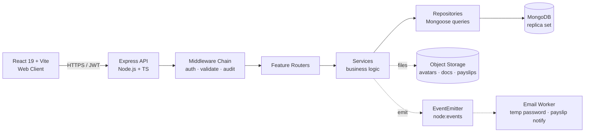
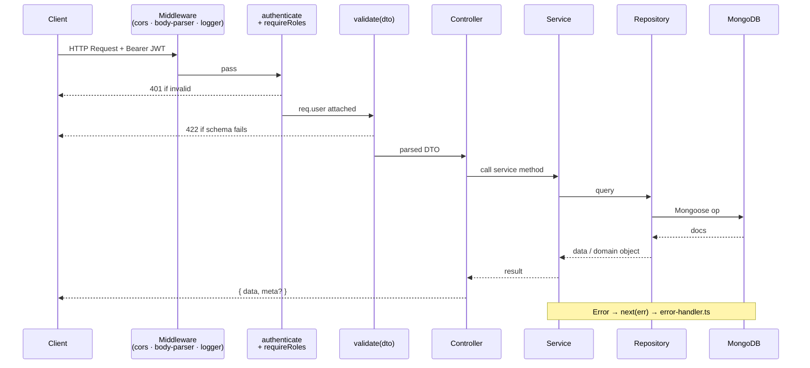
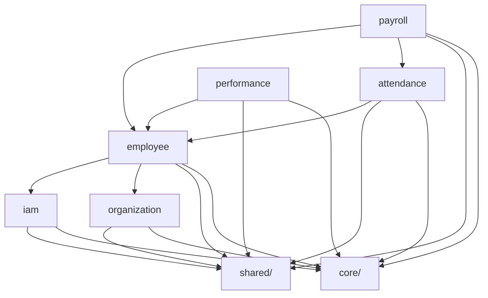

# Soosky HRM — Backend Architecture

> **Stack:** Node.js · TypeScript · Express · Mongoose · MongoDB
> **Style:** Monolith, feature-based organization
> **Related:** [DATABASE.md](./DATABASE.md), [CONVENTIONS.md](./CONVENTIONS.md)

---

## 1. System Overview



**Rationale for feature-based organization:**

- Each feature = one self-contained folder (routes + service + repository + models + DTOs).
- New team members locate code by domain, not by layer.
- Cross-feature coupling is explicit (re-exported via `index.ts`) and easy to audit.
- A feature can be extracted into a separate service later with minimal refactor.

**System components:**

- **Client:** React 19 (Vite) — talks to API over HTTPS with JWT bearer tokens.
- **API:** single Express process; horizontally scalable behind a load balancer.
- **Database:** MongoDB replica set (required for multi-document transactions used in account provisioning, payroll computation, leave approval).
- **Object storage:** S3-compatible bucket for `employeeDocuments.fileUrl`, `payslips.fileUrl`, `employeeProfiles.avatarUrl`.
- **Async work:** in-process `EventEmitter` for v1 (email, notifications); a message broker can be swapped in later without changing emitters.

---

## 2. Folder Structure

```
src/
├── main.ts                       # Bootstrap: load env, connect DB, register middleware, start HTTP
├── app.ts                        # Express app factory (testable)
├── config/
│   ├── env.ts                    # Zod-validated process.env
│   ├── database.config.ts        # Mongoose connection options
│   └── jwt.config.ts             # JWT secrets & TTLs
├── core/
│   ├── database/
│   │   └── mongoose.ts           # connect/disconnect helpers, plugins (decimal128, lean)
│   ├── logger/
│   │   └── logger.ts             # Pino root logger
│   └── events/
│       └── event-bus.ts          # Typed EventEmitter wrapper
├── shared/
│   ├── middlewares/
│   │   ├── authenticate.ts       # JWT verify → req.user
│   │   ├── require-roles.ts      # role guard
│   │   ├── require-permission.ts # permission guard
│   │   ├── validate.ts           # Zod request validation
│   │   ├── audit.ts              # write to auditLogs
│   │   └── error-handler.ts      # global error → JSON response
│   ├── errors/
│   │   ├── http-error.ts
│   │   ├── not-found.error.ts
│   │   └── forbidden.error.ts
│   ├── utils/
│   │   ├── pagination.util.ts
│   │   ├── hash.util.ts          # bcrypt wrappers
│   │   └── money.util.ts         # Decimal128 helpers
│   ├── types/
│   │   ├── auth-payload.type.ts  # { userId, roles, permissions }
│   │   ├── response.type.ts
│   │   └── pagination.type.ts
│   └── models/                   # ALL Mongoose Schemas & Models live here
│       ├── user.model.ts
│       ├── role.model.ts
│       ├── permission.model.ts
│       ├── user-role.model.ts
│       ├── role-permission.model.ts
│       ├── session.model.ts
│       ├── audit-log.model.ts
│       ├── department.model.ts
│       ├── position.model.ts
│       ├── employee.model.ts
│       └── ...                   # one file per collection in DATABASE.md
└── features/
    ├── iam/                      # users · roles · permissions · sessions · auth · audit logs
    ├── organization/             # departments · positions
    ├── employee/                 # employee + profile/documents/contracts/contacts/...
    ├── attendance/               # shifts · attendances · leave requests/balances · holidays
    ├── payroll/                  # periods · salary structures · allowances · payrolls · payslips
    └── performance/              # appraisal cycles · goals · KPIs · reviews · feedbacks
```

---

## 3. Feature Anatomy

> **Note:** Mongoose models are NOT inside features. They all live in `src/shared/models/` and are
> imported via `@shared/models/[entity].model`. Each feature owns only its
> controllers/services/repositories/dto/routes.

### 3.1 Simple feature — `iam`

```
features/iam/
├── index.ts                      # public surface: services exported here
├── iam.routes.ts                 # /auth, /users, /roles, /permissions
├── controllers/
│   ├── auth.controller.ts        # /auth/login, /auth/refresh, /auth/logout
│   ├── user.controller.ts
│   └── role.controller.ts
├── services/
│   ├── auth.service.ts           # login, refresh, logout (session revoke)
│   ├── user.service.ts
│   └── role.service.ts
├── repositories/                 # use @shared/models/* — never declare schemas here
│   ├── user.repository.ts
│   ├── role.repository.ts
│   ├── user-role.repository.ts
│   └── session.repository.ts
├── strategies/
│   └── jwt.strategy.ts           # access + refresh token issue/verify
├── dto/
│   ├── login.dto.ts
│   ├── refresh.dto.ts
│   └── auth-response.dto.ts
├── types/
│   └── jwt-payload.type.ts
├── tests/
│   ├── auth.service.spec.ts
│   └── auth.controller.spec.ts
└── CONTEXT.md
```

### 3.2 Multi-entity feature — `employee`

```
features/employee/
├── index.ts
├── employee.routes.ts
├── controllers/
│   ├── employee.controller.ts        # CRUD + grant-login
│   ├── employee-profile.controller.ts
│   ├── employee-document.controller.ts
│   ├── employee-contract.controller.ts
│   └── employee-asset.controller.ts
├── services/
│   ├── employee.service.ts
│   ├── account-provisioning.service.ts  # grant-login flow (atomic, uses session)
│   ├── employee-profile.service.ts
│   └── employee-history.service.ts      # writes timeline on changes
├── repositories/                     # use @shared/models/* (see DATABASE.md §2.3)
│   ├── employee.repository.ts
│   ├── employee-profile.repository.ts
│   ├── employee-document.repository.ts
│   ├── employee-contact.repository.ts
│   ├── employee-bank-account.repository.ts
│   ├── employee-contract.repository.ts
│   ├── employee-history.repository.ts
│   └── employee-asset.repository.ts
├── dto/, types/, tests/, CONTEXT.md
```

### 3.3 Workflow-heavy feature — `payroll`

```
features/payroll/
├── index.ts
├── payroll.routes.ts
├── controllers/
│   ├── payroll-period.controller.ts
│   ├── payroll.controller.ts        # list, approve, mark-paid
│   ├── salary-structure.controller.ts
│   └── payslip.controller.ts
├── services/
│   ├── payroll-period.service.ts
│   ├── payroll-compute.service.ts   # gross → tax/insurance → net (atomic, transactional)
│   ├── payslip-generator.service.ts # PDF generation + upload + email
│   ├── salary-structure.service.ts
│   └── allowance.service.ts
├── repositories/                    # use @shared/models/* (see DATABASE.md §2.5)
│   └── (one per entity in DATABASE.md §2.5)
├── dto/, types/, tests/, CONTEXT.md
```

---

## 4. Request Flow



**Layer responsibilities:**

- **Middleware:** CORS, body parsing, request id, request logging.
- **Auth middlewares:** `authenticate` verifies JWT → attaches `req.user`; `requireRoles` / `requirePermission` gate access.
- **Validation:** `validate(zodSchema, 'body' | 'query' | 'params')` parses & coerces.
- **Controller:** HTTP only — extract input, call service, shape response. No business logic.
- **Service:** business rules, orchestrate repositories, manage Mongoose transactions.
- **Repository:** Mongoose queries, aggregations, `.lean()`, `populate`. No HTTP, no business rules.

**Example — Account provisioning (`POST /employees/:id/grant-login`):**

1. `authenticate` validates HR's access token → `req.user`.
2. `requireRoles('admin', 'hr_manager')` checks role.
3. `validate(grantLoginDto, 'body')` parses request body (optional override email).
4. `EmployeeController.grantLogin` → `AccountProvisioningService.grantLogin(employeeId, hrUserId)`.
5. Service opens Mongoose `session.withTransaction(...)`:
   - Create `User` (`mustChangePassword: true`, bcrypt-hashed temp password).
   - Update `Employee.userId`.
   - Insert `UserRole` (role = `employee`).
   - Insert `AuditLog`.
6. Service emits `employee.granted-login` event → email worker sends temp password.
7. Controller responds `200 { data: { userId, employeeId } }`.

---

## 5. Cross-Feature Communication



**Allowed:**

- **Public exports via `index.ts`:** `import { EmployeeService } from '@features/employee'` — only what's re-exported is callable.
- **Shared services / utilities** in `src/shared/` (pagination, hashing, money utils).
- **Event bus** (`core/events/event-bus.ts`) for async cross-feature reactions:
  - `employee.granted-login` → email temp password
  - `payroll.computed` → notify employee
  - `leave.approved` → adjust `leaveBalances`
  - `employee.changed` → write to `employeeHistories`

**Forbidden:**

- ❌ `import { EmployeeService } from '../employee/services/employee.service'` (private path) from `payroll`
- ✅ `import { EmployeeService } from '@features/employee'` (only via public `index.ts`)
- ✅ `import { Employee } from '@shared/models/employee.model'` is allowed anywhere — models are shared
- ❌ Circular feature dependency → refactor to event or shared service.

**Feature dependencies:**

| Feature        | Depends on               | Reason                                    |
| -------------- | ------------------------ | ----------------------------------------- |
| `iam`          | —                        | Standalone foundation                     |
| `organization` | —                        | Standalone                                |
| `employee`     | `iam`, `organization`    | Links to `User`, `Department`, `Position` |
| `attendance`   | `employee`               | Records belong to employees               |
| `payroll`      | `employee`, `attendance` | Needs work/leave days for prorating       |
| `performance`  | `employee`               | Reviews belong to employees               |

---

## 6. Shared vs Core

| `shared/` (request-scoped utilities)                           | `core/` (infrastructure singletons)                    |
| -------------------------------------------------------------- | ------------------------------------------------------ |
| `authenticate`, `requireRoles`, `requirePermission` middleware | `core/database/mongoose.ts` — connection lifecycle     |
| `validate(zodSchema)` middleware                               | `core/logger/logger.ts` — Pino root logger             |
| `error-handler` global middleware                              | `core/events/event-bus.ts` — typed EventEmitter        |
| `HttpError`, `NotFoundError`, `ForbiddenError`                 | Process-level concerns (shutdown hooks, health checks) |
| `pagination.util`, `hash.util`, `money.util`                   |                                                        |
| `AuthPayload`, `Response<T>`, `Paginated<T>` types             |                                                        |

Rule of thumb: if it's stateless and used per-request, it's `shared/`. If it holds a lifecycle/connection/singleton, it's `core/`.

---

## 7. Configuration Management

**Environment variables (`.env`):**

```
NODE_ENV=development
PORT=3000
MONGO_URI=mongodb://localhost:27017/soosky_hrm?replicaSet=rs
JWT_ACCESS_SECRET=<32+ chars>
JWT_REFRESH_SECRET=<32+ chars>
JWT_ACCESS_TTL=15m
JWT_REFRESH_TTL=7d
BCRYPT_ROUNDS=10
S3_ENDPOINT=...
S3_BUCKET=soosky-hrm
SMTP_HOST=...
```

**Config structure:**

- `config/env.ts` — Zod-parses `process.env` once at boot; exports typed `env` object.
- `config/database.config.ts` — derives Mongoose connect options from `env`.
- `config/jwt.config.ts` — derives JWT issue/verify options from `env`.
- All code accesses settings via the typed `env` import — **never** `process.env.X` directly.

**Secrets handling:**

- `.env` gitignored; commit `.env.example` as template.
- Production: env vars injected by deployment platform or a secret manager (AWS Secrets Manager, Vault).
- Rotate `JWT_*_SECRET` quarterly; rotation invalidates outstanding refresh tokens by design.

---

## 8. Node.js + Mongoose Specifics

- **Bootstrap order in `main.ts`:** load env → connect Mongo → register global middleware → mount feature routers → register error handler **last** → `app.listen()`.
- **Mongoose connection:** single connection pool; abort startup if connection fails. Use `mongoose.connection.on('error' | 'disconnected')` for observability.
- **Transactions** (require replica set):
  - `mongoose.startSession()` → `session.withTransaction(async () => { ... })`.
  - Mandatory for: account provisioning, payroll computation, leave approval (request + balance), employee history writes alongside the change.
- **Schema lifecycle hooks** for cross-cutting concerns:
  - `pre('save')` on `users` to hash `password` when modified.
  - `pre('save')` on `employees` to enforce status transitions.
  - `post('save')` to emit domain events via the shared event bus.
- **Indexes:** declared in schema files, applied via `mongoose.connection.syncIndexes()` at boot (development) or migration scripts (production).
- **Plugins:**
  - `mongoose-decimal128` for transparent JSON serialization of money fields.
  - Custom `softDelete` plugin (no-op for HRM — we use `status`, but plugin enforces no `.deleteOne()` on HR collections).
- **Graceful shutdown:** trap `SIGTERM` → stop accepting requests → drain in-flight → `mongoose.disconnect()` → exit.
