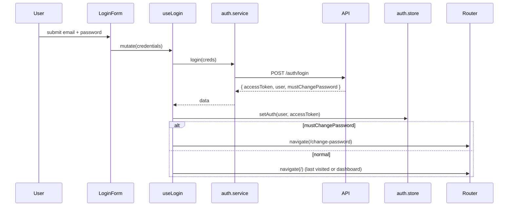

# Soosky HRM — Frontend Architecture

> **Stack:** React 19 + Vite · TypeScript (strict) · Zustand + TanStack Query · Tailwind · React Router v7 · Axios · React Hook Form + Zod
> **Related:** [API_SPEC.md](./API_SPEC.md) · [FRONTEND_RULES.md](./FRONTEND_RULES.md) · [ARCHITECTURE.md](./ARCHITECTURE.md) (backend)

---

## 1. Overview

Feature-based architecture: each domain (auth, employee, attendance, payroll, …) is a self-contained module owning its components, hooks, services, types, and pages. Cross-feature coupling is explicit via barrel exports and the global stores.

**Tech stack rationale:**

- **React 19 + Vite** — fast HMR, modern React features (`use` hook, Actions, transitions for heavy tables).
- **TypeScript strict** — type safety, fewer regressions in a 100-person team.
- **TanStack Query v5** — server cache & invalidation; perfect fit for HRM's mostly read-heavy CRUD + admin mutations.
- **Zustand** — minimal global client state (auth user + UI prefs); avoids over-engineering a Redux setup.
- **Tailwind** — utility-first, consistent design tokens; pairs with shadcn-style component library for tables/forms.
- **Axios** — interceptors handle 401 → refresh-token rotation transparently.
- **React Router v7** — type-safe routing, nested layouts, lazy-loaded route boundaries.
- **React Hook Form + Zod** — performant forms with shared validation schema (matches backend Zod DTOs).

---

## 2. Folder Structure

```
src/
├── main.tsx                       # entry: <StrictMode> → <App />
├── App.tsx                        # providers: QueryClient, RouterProvider, Toaster
├── config/
│   ├── env.ts                     # validated import.meta.env (Zod)
│   ├── constants.ts               # PAGE_SIZE, MAX_AVATAR_SIZE, …
│   └── permissions.ts             # PERMISSIONS.PAYROLL_APPROVE, ROLES.HR_MANAGER
├── routes/
│   ├── index.tsx                  # createBrowserRouter + lazy pages
│   ├── routes.ts                  # ROUTES path constants
│   ├── ProtectedRoute.tsx         # requires auth → else <Navigate to LOGIN />
│   ├── MustChangePasswordRoute.tsx# forces /change-password before app
│   └── RoleRoute.tsx              # role / permission guard
├── layouts/
│   ├── AppLayout.tsx              # sidebar + topbar + <Outlet />
│   ├── AuthLayout.tsx             # centered card (login, reset password)
│   └── PrintLayout.tsx            # minimal chrome (payslip print)
├── shared/
│   ├── components/
│   │   ├── ui/                    # Button, Input, Select, Modal, Tabs, Tooltip
│   │   ├── data/                  # DataTable, EmptyState, Pagination
│   │   ├── form/                  # FormField, FileUploader, DateRangePicker
│   │   ├── feedback/              # Skeleton, Spinner, Toast, ErrorState
│   │   └── layout/                # Sidebar, Topbar, Breadcrumbs
│   ├── hooks/
│   │   ├── useDebounce.ts
│   │   ├── useLocalStorage.ts
│   │   ├── useMediaQuery.ts
│   │   └── useCan.ts              # permission check helper
│   ├── lib/
│   │   ├── axios.ts               # axios instance + interceptors
│   │   ├── queryClient.ts         # TanStack Query config
│   │   ├── queryKeys.ts           # central queryKey factories
│   │   └── dayjs.ts               # locale, timezone setup
│   ├── stores/
│   │   ├── auth.store.ts          # user, accessToken, mustChangePassword
│   │   └── ui.store.ts            # sidebarCollapsed, theme
│   ├── types/
│   │   ├── api.types.ts           # ApiResponse<T>, Paginated<T>, ApiError
│   │   └── common.types.ts        # ID, ISODate, MoneyString
│   └── utils/
│       ├── money.utils.ts         # parseDecimal, formatVND
│       ├── date.utils.ts          # formatDate, businessDaysBetween
│       └── permission.utils.ts    # can(payload, key)
├── features/
│   ├── auth/                      # login, change-password, forgot/reset, sessions
│   ├── iam/                       # admin: users, roles, permissions, audit logs
│   ├── organization/              # departments tree, positions
│   ├── employee/                  # employee CRUD + sub-resources
│   ├── attendance/                # check-in/out, leave requests/approval, balances, holidays
│   ├── payroll/                   # periods, compute, payslips, salary structures
│   └── performance/               # cycles, goals, KPIs, reviews, feedbacks
└── assets/
    ├── images/
    └── icons/
```

---

## 3. Feature Anatomy

### 3.1 `auth` — login, password change, session management

```
features/auth/
├── components/
│   ├── LoginForm.tsx
│   ├── ChangePasswordForm.tsx     # forced on first login
│   ├── ForgotPasswordForm.tsx
│   ├── ResetPasswordForm.tsx
│   └── SessionList.tsx            # own active sessions, revoke per device
├── hooks/
│   ├── useLogin.ts                # useMutation → axios + auth.store
│   ├── useChangePassword.ts
│   ├── useRefreshToken.ts         # silently called by axios interceptor
│   ├── useLogout.ts               # revoke session, clear store
│   └── useMe.ts                   # useQuery /auth/me
├── services/
│   └── auth.service.ts            # login, logout, refresh, change-password, sessions
├── types/
│   └── auth.types.ts              # AuthUser, LoginRequest, AuthResponse, Session
├── schemas/
│   ├── login.schema.ts            # Zod
│   └── change-password.schema.ts
├── pages/
│   ├── LoginPage.tsx
│   ├── ChangePasswordPage.tsx
│   ├── ForgotPasswordPage.tsx
│   └── ResetPasswordPage.tsx
├── index.ts
└── CONTEXT.md
```

### 3.2 `employee` — most complex domain (8 sub-resources)

```
features/employee/
├── components/
│   ├── EmployeeTable.tsx          # paginated, filterable
│   ├── EmployeeFilters.tsx        # department, status, search
│   ├── EmployeeCard.tsx           # compact summary
│   ├── EmployeeForm.tsx           # create / edit core + profile
│   ├── GrantLoginDialog.tsx       # HR action: provision account
│   ├── TerminateDialog.tsx
│   └── tabs/
│       ├── ProfileTab.tsx
│       ├── DocumentsTab.tsx
│       ├── ContactsTab.tsx
│       ├── BankAccountsTab.tsx
│       ├── ContractsTab.tsx
│       ├── HistoryTab.tsx
│       └── AssetsTab.tsx
├── hooks/
│   ├── useEmployees.ts            # paginated list
│   ├── useEmployee.ts             # detail
│   ├── useCreateEmployee.ts
│   ├── useGrantLogin.ts           # POST /admin/employees/:id/grant-login
│   ├── useTerminateEmployee.ts
│   └── useEmployeeDocuments.ts    # nested resource
├── services/
│   └── employee.service.ts
├── types/
│   └── employee.types.ts
├── schemas/
│   ├── create-employee.schema.ts
│   └── grant-login.schema.ts
├── utils/
│   └── employee.utils.ts          # mappers, formatters
├── pages/
│   ├── EmployeeListPage.tsx
│   ├── EmployeeDetailPage.tsx     # tabbed
│   └── EmployeeCreatePage.tsx
├── index.ts
└── CONTEXT.md
```

### 3.3 `attendance` — workflow-heavy (check-in + leave management)

```
features/attendance/
├── components/
│   ├── CheckInOutWidget.tsx       # large dashboard tile
│   ├── MyAttendanceCalendar.tsx
│   ├── LeaveRequestForm.tsx
│   ├── LeaveBalanceCard.tsx
│   ├── LeaveApprovalQueue.tsx     # manager view
│   ├── ShiftEditor.tsx            # admin
│   └── HolidayList.tsx
├── hooks/
│   ├── useCheckIn.ts              # mutation
│   ├── useCheckOut.ts
│   ├── useMyAttendance.ts
│   ├── useSubmitLeave.ts
│   ├── useApproveLeave.ts         # optimistic update + invalidate pending list
│   ├── useRejectLeave.ts
│   └── useLeaveBalance.ts
├── services/
│   ├── attendance.service.ts
│   └── leave.service.ts
├── types/, schemas/, utils/, pages/, index.ts, CONTEXT.md
```

### 3.4 `payroll` — admin workflow (compute → approve → pay)

```
features/payroll/
├── components/
│   ├── PayrollPeriodList.tsx
│   ├── PayrollPeriodForm.tsx
│   ├── ComputePayrollDialog.tsx   # confirms scope, shows progress
│   ├── PayrollTable.tsx           # per-employee breakdown
│   ├── PayrollDetailDrawer.tsx    # breakdown by allowance/deduction/tax
│   ├── PayslipViewer.tsx          # PDF embed or generated view
│   ├── SalaryStructureForm.tsx
│   └── AllowanceEditor.tsx
├── hooks/
│   ├── usePayrollPeriods.ts
│   ├── useComputePayroll.ts       # mutation, long-running w/ poll or stream
│   ├── useApprovePayroll.ts
│   ├── useMarkPaid.ts
│   ├── useMyPayslips.ts
│   └── usePayslip.ts
├── services/, types/, schemas/, utils/, pages/, index.ts, CONTEXT.md
```

---

## 4. Data Flow

```
User Action → Component → Hook (TanStack Query) → Service → Axios → API
                                  ↓
                       Cache Update / Store Update
                                  ↓
                            UI Re-render
```

### Example 1 — Login + must-change-password



### Example 2 — Submit leave request

1. User opens **LeaveRequestForm** on `/me/leave`.
2. RHF + Zod validates `startDate`, `endDate`, `leaveType`, `reason`.
3. `useSubmitLeave().mutate(data)` calls `leave.service.submit()`.
4. `POST /leave-requests` returns the created request + `balanceAfter`.
5. **onSuccess** invalidates `['leave-requests', 'me']` and `['leave-balance', 'me']`; toast "Submitted, awaiting approval".
6. Approver receives notification via the existing approval queue (refetched on focus).

### Example 3 — HR grants login to a new employee

1. HR opens `EmployeeDetailPage` → clicks **Grant Login**.
2. `GrantLoginDialog` confirms target personal email.
3. `useGrantLogin().mutate({ id })` → `POST /admin/employees/:id/grant-login`.
4. Server runs atomic transaction; returns `{ userId, tempPasswordSentTo }`.
5. **onSuccess** invalidates `['employees']` and `['employee', id]`; toast "Credentials sent to <email>".
6. Sidebar badge "Pending login" disappears for that employee.

### Example 4 — Compute payroll for a period

1. HR opens `PayrollPeriodDetailPage` → clicks **Compute**.
2. `ComputePayrollDialog` shows scope (all active or selected employees) + optional `dryRun`.
3. `useComputePayroll().mutate({ periodId, employeeIds, dryRun })` → `POST /admin/payroll-periods/:id/compute`.
4. Long-running request (or polled async job) — UI shows progress bar.
5. **onSuccess** invalidates `['payrolls', periodId]`; renders results table with `computed`, `skipped`, `errors[]`.

---

## 5. Cross-feature Communication

| Method                            | Use case                            | Example                                                                         |
| --------------------------------- | ----------------------------------- | ------------------------------------------------------------------------------- |
| **Global Zustand store**          | Auth state app-wide                 | `auth.store` → `user`, `roles`, `accessToken`, `mustChangePassword`             |
| **TanStack Query cache**          | Shared lookup data                  | `['departments']`, `['positions']` consumed by employee + organization features |
| **Central queryKeys**             | Stable invalidation across features | `keys.employee.detail(id)` in `shared/lib/queryKeys.ts`                         |
| **URL search params**             | Filters, pagination, tab state      | `?departmentId=...&status=active&page=2&tab=documents`                          |
| **React Router params**           | Detail routes                       | `/employees/:id`, `/payroll/periods/:id`                                        |
| **Feature `index.ts` re-exports** | Public APIs only                    | `import { useEmployee } from '@features/employee'`                              |
| **Toaster** (notifications)       | Cross-feature side effects          | `toast.success('Leave approved')` from any feature                              |

**Feature dependencies:**

| Feature        | Depends on                       | Reason                            |
| -------------- | -------------------------------- | --------------------------------- |
| `auth`         | —                                | Provides `auth.store` for all     |
| `iam`          | `auth`                           | Admin tools for users/roles       |
| `organization` | —                                | Standalone; provides lookup data  |
| `employee`     | `auth`, `organization`           | Department/position selectors     |
| `attendance`   | `auth`, `employee`               | Manager picks employee in HR view |
| `payroll`      | `auth`, `employee`, `attendance` | Pull work/leave days for compute  |
| `performance`  | `auth`, `employee`               | Reviews target employees          |

---

## 6. Routing Structure

```mermaid
graph TB
  ROOT[/ — RouterProvider]
  AUTH[/login · /forgot-password · /reset-password<br/>AuthLayout]
  CHGPWD[/change-password<br/>AuthLayout + Protected]
  APP[Protected + MustChangePassword + AppLayout]
  ME[/me/* — self-service]
  HR[/employees · /attendance · /payroll · /performance · /organization<br/>RoleRoute hr_manager · manager · admin]
  ADMIN[/admin/* — RoleRoute admin]

  ROOT --> AUTH
  ROOT --> CHGPWD
  ROOT --> APP
  APP --> ME
  APP --> HR
  APP --> ADMIN
```

**Route constants** (`routes/routes.ts`):

```ts
export const ROUTES = {
  // Auth
  LOGIN: "/login",
  CHANGE_PASSWORD: "/change-password",
  FORGOT_PASSWORD: "/forgot-password",
  RESET_PASSWORD: "/reset-password",
  // Self-service
  DASHBOARD: "/",
  MY_PROFILE: "/me/profile",
  MY_ATTENDANCE: "/me/attendance",
  MY_LEAVE: "/me/leave",
  MY_PAYSLIPS: "/me/payslips",
  MY_GOALS: "/me/goals",
  // Employee
  EMPLOYEES: "/employees",
  EMPLOYEE_DETAIL: "/employees/:id",
  EMPLOYEE_NEW: "/employees/new",
  // Organization
  DEPARTMENTS: "/organization/departments",
  POSITIONS: "/organization/positions",
  // Attendance / Leave admin
  ATTENDANCE: "/attendance",
  LEAVE_APPROVAL: "/leave/approval",
  // Payroll
  PAYROLL_PERIODS: "/payroll/periods",
  PAYROLL_PERIOD_DETAIL: "/payroll/periods/:id",
  // Performance
  APPRAISAL_CYCLES: "/performance/cycles",
  PERFORMANCE_REVIEWS: "/performance/reviews",
  REVIEW_DETAIL: "/performance/reviews/:id",
  // Admin
  ADMIN_USERS: "/admin/users",
  ADMIN_ROLES: "/admin/roles",
  ADMIN_AUDIT_LOGS: "/admin/audit-logs",
} as const;
```

**Route config skeleton** (`routes/index.tsx`):

```tsx
import { createBrowserRouter, Outlet } from "react-router";
import { lazy } from "react";

const LoginPage = lazy(() => import("@/features/auth/pages/LoginPage"));
const ChangePasswordPage = lazy(
  () => import("@/features/auth/pages/ChangePasswordPage"),
);
const DashboardPage = lazy(
  () => import("@/features/dashboard/pages/DashboardPage"),
);
const EmployeeListPage = lazy(
  () => import("@/features/employee/pages/EmployeeListPage"),
);
// ... other pages

export const router = createBrowserRouter([
  {
    element: <AuthLayout />,
    children: [
      { path: ROUTES.LOGIN, element: <LoginPage /> },
      { path: ROUTES.FORGOT_PASSWORD, element: <ForgotPasswordPage /> },
      { path: ROUTES.RESET_PASSWORD, element: <ResetPasswordPage /> },
    ],
  },
  {
    element: <ProtectedRoute />,
    children: [
      {
        element: <AuthLayout />,
        children: [
          { path: ROUTES.CHANGE_PASSWORD, element: <ChangePasswordPage /> },
        ],
      },
      {
        element: <MustChangePasswordRoute />,
        children: [
          {
            element: <AppLayout />,
            children: [
              { index: true, element: <DashboardPage /> },
              // self-service
              { path: ROUTES.MY_PROFILE, element: <MyProfilePage /> },
              { path: ROUTES.MY_ATTENDANCE, element: <MyAttendancePage /> },
              { path: ROUTES.MY_LEAVE, element: <MyLeavePage /> },
              { path: ROUTES.MY_PAYSLIPS, element: <MyPayslipsPage /> },
              // HR / manager
              {
                element: (
                  <RoleRoute roles={["hr_manager", "manager", "admin"]} />
                ),
                children: [
                  { path: ROUTES.EMPLOYEES, element: <EmployeeListPage /> },
                  {
                    path: ROUTES.EMPLOYEE_DETAIL,
                    element: <EmployeeDetailPage />,
                  },
                  {
                    path: ROUTES.EMPLOYEE_NEW,
                    element: <EmployeeCreatePage />,
                  },
                  // ... more
                ],
              },
              // admin only
              {
                element: <RoleRoute roles={["admin"]} />,
                children: [
                  { path: ROUTES.ADMIN_USERS, element: <AdminUsersPage /> },
                  { path: ROUTES.ADMIN_ROLES, element: <AdminRolesPage /> },
                  {
                    path: ROUTES.ADMIN_AUDIT_LOGS,
                    element: <AdminAuditLogsPage />,
                  },
                ],
              },
            ],
          },
        ],
      },
    ],
  },
]);
```

**Guards order:** `ProtectedRoute` (auth) → `MustChangePasswordRoute` (forced reset) → `RoleRoute` (role / permission).

**Lazy loading:** all page components via `React.lazy()`; layout-level `<Suspense fallback={<PageSkeleton />}>`.

---

## 7. State Management Strategy

| State Type     | Tool                   | Example                                                             |
| -------------- | ---------------------- | ------------------------------------------------------------------- |
| Server data    | TanStack Query         | `useEmployees`, `useLeaveBalance`, `useMyPayslips`                  |
| Auth           | Zustand (`auth.store`) | `user`, `accessToken`, `roles`, `permissions`, `mustChangePassword` |
| UI prefs       | Zustand (`ui.store`)   | `sidebarCollapsed`, `theme`                                         |
| URL state      | `useSearchParams`      | `?departmentId=...&page=2&tab=documents`                            |
| Form state     | React Hook Form        | Leave request, employee create wizard, payroll period               |
| Local UI state | `useState`             | Modal open, tab active, dropdown                                    |

**Rules:**

- Server data **NEVER** in Zustand — always TanStack Query.
- Only `auth` and lightweight UI prefs in Zustand.
- Filters & pagination in URL → shareable links, deep-linking into tables.
- Form state local to the form (React Hook Form).

---

## 8. API Layer

```
shared/lib/axios.ts             # base client
├── baseURL = env.API_BASE_URL
├── request interceptor — attach Authorization: Bearer <accessToken>
├── response interceptor — 401 → refresh once → retry; 5xx → toast
└── error interceptor    — map { error: { code, message } } → ApiError
     ↓
features/<feature>/services/*.service.ts
├── declare endpoints, type params + response
└── transform only when API and UI shape diverge
     ↓
features/<feature>/hooks/use*.ts
├── useQuery for GET — central queryKey via shared/lib/queryKeys.ts
├── useMutation for POST/PATCH/DELETE
└── invalidate / set queries on success; toast on success/error
     ↓
features/<feature>/components/*.tsx
└── consume hooks; render loading / error / data states
```

**Service example:**

```ts
// features/employee/services/employee.service.ts
import { api } from "@/shared/lib/axios";
import type { Employee, ListEmployeesParams } from "../types/employee.types";

export const employeeService = {
  list: (params: ListEmployeesParams) =>
    api.get<Paginated<Employee>>("/employees", { params }).then((r) => r.data),
  getById: (id: string) =>
    api.get<ApiResponse<Employee>>(`/employees/${id}`).then((r) => r.data.data),
  grantLogin: (id: string) =>
    api.post(`/admin/employees/${id}/grant-login`).then((r) => r.data.data),
};
```

**Hook example:**

```ts
// features/employee/hooks/useGrantLogin.ts
export function useGrantLogin() {
  const qc = useQueryClient();
  return useMutation({
    mutationFn: employeeService.grantLogin,
    onSuccess: (_, id) => {
      qc.invalidateQueries({ queryKey: keys.employee.detail(id) });
      qc.invalidateQueries({ queryKey: keys.employee.list._def });
      toast.success("Login credentials sent to personal email");
    },
    onError: (err: ApiError) => toast.error(errorMessage(err)),
  });
}
```

**Central query keys** (`shared/lib/queryKeys.ts`):

```ts
export const keys = {
  employee: {
    list: (params?: ListEmployeesParams) =>
      ["employees", params ?? {}] as const,
    detail: (id: string) => ["employee", id] as const,
    history: (id: string) => ["employee", id, "history"] as const,
  },
  payroll: {
    periods: ["payroll", "periods"] as const,
    period: (id: string) => ["payroll", "period", id] as const,
    mine: ["payroll", "me"] as const,
  },
  // ...
};
```

---

## 9. Shared vs Features

| `src/shared/`                                            | `src/features/`                                 |
| -------------------------------------------------------- | ----------------------------------------------- |
| Button, Input, Select, Modal, Tabs, DataTable            | EmployeeTable, LeaveRequestForm, PayslipViewer  |
| useDebounce, useLocalStorage, useCan                     | useEmployees, useSubmitLeave, useComputePayroll |
| axios instance, queryClient, queryKey factories          | employee.service, payroll.service               |
| `ApiResponse<T>`, `Paginated<T>`, `ApiError`, `AuthUser` | `Employee`, `LeaveRequest`, `Payroll`, `Goal`   |
| money.utils, date.utils, permission.utils                | employee.utils, payroll.utils                   |
| Skeleton, Spinner, ErrorState, ErrorBoundary             | EmployeeRowSkeleton, PayslipSkeleton            |

**Import rules:**

- ✅ Features → `shared/`
- ✅ Features → other features' **public `index.ts`** (e.g., department selector from `@features/organization`)
- ❌ Features → other features' internals
- ❌ `shared/` → `features/`

---

## 10. Cross-cutting Concerns

**Error handling**

- **Axios response interceptor** normalizes errors to `ApiError { code, message, status, details? }`.
- **401** → call `/auth/refresh` once → retry; if still 401, clear auth store + `Navigate to LOGIN`.
- **403** → toast "Insufficient permission".
- **5xx** → toast "Something went wrong".
- **Route-level `errorElement`** for navigation/loading failures.
- **App-level `<ErrorBoundary>`** at `AppLayout` for unexpected render errors.

**Loading**

- Skeletons for first-paint of heavy tables (employees, payrolls).
- Spinners / disabled buttons for in-flight mutations (check-in, compute payroll).
- Optimistic updates: leave approval, set-primary-bank-account, goal progress.
- `<Suspense fallback={<PageSkeleton />}>` at layout level for lazy routes.

**Permissions in UI**

- Hide / disable actions: `const can = useCan(); {can(PERMISSIONS.PAYROLL_APPROVE) && <ApproveButton />}`.
- Page-level guards via `<RoleRoute roles={['hr_manager','admin']} />`.
- UI gating is **UX only** — the backend remains the source of truth.

**Internationalization (future)**

- `react-i18next` ready: copy lives in `src/locales/<lang>/<feature>.json`; not blocking v1.
