# Soosky HRM — Database Design

> **Project:** Soosky HRM
> **Scope:** Admin > HR > Employee
> **Stack:** MongoDB + Mongoose + TypeScript
> **Architecture:** Monolith, organized by feature (each feature owns its collections)

---

## 1. Overview

### 1.1 Database

- **DBMS:** MongoDB
- **ODM:** Mongoose

### 1.2 Naming Conventions

- **Collections:** `camelCase`, plural — e.g., `users`, `employeeProfiles`, `payrollPeriods`
- **Fields:** `camelCase` — e.g., `firstName`, `employeeId`, `lastLoginAt`
- **References:** `ObjectId` with `ref` pointing to the **collection name**

  ```ts
  userId: { type: Schema.Types.ObjectId, ref: 'users' }
  ```

- **Indexes:** declare via `index: true` on the field, or compound via `schema.index(...)`

  ```ts
  email: { type: String, required: true, unique: true, index: true }
  schema.index({ employeeId: 1, date: 1 }, { unique: true })
  ```

- **Timestamps:** auto-managed by Mongoose with snake_case column names

  ```ts
  { timestamps: { createdAt: 'created_at', updatedAt: 'updated_at' } }
  ```

- **Soft delete:** never hard-delete HR records; use a `status` field
- **Money fields:** use `Decimal128` for payroll precision (avoid floating-point errors)
- **Identifier-like strings** (`accountNumber`, `phone`, `employeeCode`): store as `String` to preserve leading zeros & formatting

---

## 2. Entities by Feature

> All collections implicitly contain `_id: ObjectId` (primary key), `created_at: Date`, and `updated_at: Date` (auto-managed by Mongoose timestamps). These are omitted from each entity definition below.

### 2.1 Identity & Access Management

**User** — Authentication identity (separate from HR record)

- `username`: String — unique login handle
- `email`: String — work email, unique, lowercase, indexed
- `password`: String — hashed (bcrypt / argon2); never stored plain
- `status`: String — `active` | `disabled` | `locked`
- `employeeId`: ObjectId ref `employees` — **nullable** (admin/system accounts have no employee)
- `mustChangePassword`: Boolean — `true` after HR grants login; forces reset on next sign-in
- `lastLoginAt`: Date
- `failedLoginAttempts`: Number — counter for lockout policy

**Indexes:** `email` unique, `username` unique, `employeeId` sparse unique

**Role** — Authorization role

- `name`: String — `admin` | `hr_manager` | `employee`, unique
- `description`: String
- `isSystem`: Boolean — built-in roles cannot be deleted

**Permission** — Granular capability

- `key`: String — dotted key, e.g., `employee:create`, `payroll:approve`, unique
- `resource`: String — e.g., `employee`, `payroll`
- `action`: String — `create` | `read` | `update` | `delete` | `approve`
- `description`: String

**UserRole** — Junction (Users ↔ Roles) with assignment metadata

- `userId`: ObjectId ref `users`
- `roleId`: ObjectId ref `roles`
- `assignedAt`: Date — default `Date.now`
- `expiresAt`: Date — optional, for temporary role grants (acting manager, project lead)

**Indexes:** compound unique `{ userId: 1, roleId: 1 }`

**RolePermission** — Junction (Roles ↔ Permissions)

- `roleId`: ObjectId ref `roles`
- `permissionId`: ObjectId ref `permissions`

**Indexes:** compound unique `{ roleId: 1, permissionId: 1 }`

**Session** — Active login session (multi-device)

- `userId`: ObjectId ref `users`, indexed
- `refreshToken`: String — hashed refresh token
- `expiresAt`: Date — TTL field
- `revokedAt`: Date — set on logout / rotation

**Indexes:** `{ expiresAt: 1 }` TTL, `{ userId: 1 }`

**AuditLog** — Compliance audit trail

- `userId`: ObjectId ref `users` — actor
- `resource`: String — e.g., `employee`, `payroll`
- `action`: String — e.g., `create`, `update`, `approve`
- `resourceId`: ObjectId — affected document
- `changes`: Object (Mixed) — JSON diff `{ before, after }`
- `timestamp`: Date — default `Date.now`

### 2.2 Employee Management

**Department**

- `name`: String — display name, e.g., `Engineering`
- `code`: String — short code, e.g., `ENG`, unique
- `parentDepartmentId`: ObjectId ref `departments` — null for root
- `managerId`: ObjectId ref `employees` — department head (trưởng phòng), nullable
- `costCenter`: String — cost-center code, optional
- `location`: String — physical location, optional
- `email`: String — department mailbox, optional, lowercase
- `description`: String
- `status`: String — `active` | `archived`

**Indexes:** `code` unique, `parentDepartmentId`, `managerId`

**Position**

- `title`: String — e.g., `Senior Backend Engineer`
- `code`: String — e.g., `BE-SR`, unique
- `departmentId`: ObjectId ref `departments`
- `level`: Number — seniority level (1 = entry)
- `description`: String

**Employee** — Core HR record (lightweight; PII lives in `employeeProfiles`)

- `employeeCode`: String — unique HR code, e.g., `EMP-0001`
- `fingerprintId`: String - unique
- `userId`: ObjectId ref `users` — **nullable** until login granted
- `departmentId`: ObjectId ref `departments`
- `positionId`: ObjectId ref `positions`
- `managerId`: ObjectId ref `employees` — direct manager (self-ref)
- `hireDate`: Date
- `terminationDate`: Date
- `employeeType`: String — `full_time` | `part_time` | `contract` | `intern`
- `status`: String — `onboarding` | `active` | `on_leave` | `terminated` default `onboarding`
- `salaryZone`: String - `zone1` | `zone2` | `zone3` | `zone4`

**Indexes:** `employeeCode` unique, `fingerprintId` sparse unique, `userId` sparse unique, `departmentId`, `managerId`

**EmployeeProfile** — PII (1:1 with `employees`)

- `employeeId`: ObjectId ref `employees`, unique
- `firstName`: String
- `lastName`: String
- `dateOfBirth`: Date
- `gender`: String — `male` | `female` | `other` | `undisclosed`
- `nationality`: String — ISO country code, e.g., `VN`
- `maritalStatus`: String — `single` | `married` | `divorced` | `widowed`
- `avatarUrl`: String — public/CDN URL
- `avatarId`: String — storage object key (for delete/replace)
- `email`: String — personal email (used to send temp password)
- `workEmail`: String — company email shown on the profile
- `phone`: String — mobile with country prefix
- `address`: String — current residential address

**EmployeeDocument** — Identity & legal documents

- `employeeId`: ObjectId ref `employees`, indexed
- `documentType`: String — `id_card` | `passport` | `degree` | `certificate` | `visa` | `other`
- `documentNumber`: String
- `fileUrl`: String
- `issuedDate`: Date
- `expiryDate`: Date
- `issuedBy`: String — issuing authority

**EmployeeContact** — Emergency / next-of-kin

- `employeeId`: ObjectId ref `employees`, indexed
- `name`: String
- `relationship`: String — `spouse` | `parent` | `sibling` | `other`
- `phone`: String
- `email`: String
- `address`: String
- `isPrimary`: Boolean — primary contact flag

**EmployeeBankAccount** — Payroll bank info

- `employeeId`: ObjectId ref `employees`, indexed
- `bankName`: String — e.g., `Vietcombank`
- `branch`: String
- `accountNumber`: String — stored as String (leading zeros)
- `accountHolder`: String — name on account
- `isPrimary`: Boolean — primary payroll account

**EmployeeContract**

- `employeeId`: ObjectId ref `employees`, indexed
- `contractType`: String — `probation` | `fixed_term` | `indefinite` | `internship`
- `contractNumber`: String, unique
- `startDate`: Date
- `endDate`: Date — null for indefinite
- `baseSalary`: Number (Decimal128) — at signing
- `currency`: String — ISO 4217, e.g., `VND`
- `fileUrl`: String — signed PDF
- `status`: String — `active` | `expired` | `terminated`

**EmployeeHistory** — HR event timeline

- `employeeId`: ObjectId ref `employees`, indexed
- `eventType`: String — `hired` | `promotion` | `transfer` | `salary_change` | `contract_renew` | `terminated`
- `fromValue`: Object (Mixed) — snapshot before change
- `toValue`: Object (Mixed) — snapshot after change
- `effectiveDate`: Date
- `note`: String
- `createdBy`: ObjectId ref `users` — HR who recorded the event

**EmployeeAsset** — Company-issued assets

- `employeeId`: ObjectId ref `employees`, indexed
- `assetName`: String — e.g., `MacBook Pro 14"`
- `assetCode`: String — asset tag / serial
- `assignedDate`: Date
- `returnedDate`: Date — null while held
- `condition`: String — `new` | `good` | `fair` | `damaged`
- `note`: String

---

### 2.4 Attendance & Leave Management

**Shift**

- `name`: String — e.g., `Morning`, `Office Hours`
- `type`: String - `morning | afternoon | full_day`
- `startTime`: String — `HH:mm` (24h)
- `endTime`: String — `HH:mm`
- `breakMinutes`: Number — unpaid break duration
- `workingDays`: [Number] — ISO weekdays, e.g., `[1,2,3,4,5]` (Mon–Fri)
- `status`: String — `active` | `archived`

**Attendance** — Daily attendance record

- `employeeId`: ObjectId ref `employees`, indexed
- `shiftId`: ObjectId ref `shifts`
- `date`: Date — attendance date (00:00 UTC)
- `checkIn`: Date — actual check-in timestamp
- `checkOut`: Date — actual check-out timestamp
- `workHours`: Number — computed regular hours
- `overtimeHours`: Number — computed overtime hours
- `overtimeType`: String - `weekday` | `weekend` | `hodiday`
- `session`: String - `morning | afternoon | full_day`
- `symbol`: String
- `leaveRequestId`: ObjectId ref leaveRequests
- `status`: String — `present` | `late` | `absent` | `leave_paid` | `leave_unpaid` | `holiday`
- `note`: String

**AttendanceSymbols** - Symbol of attendance

- `code`: String - require true - unique: true
- `label`: String
- `paidStatus`: String - `paid| unpaid | neutral`
- `affectsPayroll`: Boolean
- `leaveType`: String
- `color`: String

**Indexes:** compound unique `{ employeeId: 1, date: 1, session: 1 }`, `leaveRequestId` indexed

**LeaveRequest**

- `employeeId`: ObjectId ref `employees`, indexed
- `leaveType`: String — `annual` | `sick` | `unpaid` | `maternity` | `paternity` | `bereavement`
- `startDate`: Date
- `endDate`: Date
- `days`: Number — computed (excl. weekends/holidays)
- `halfDaySession`: String - `morning | afternoon` default null
- `reason`: String
- `status`: String — `pending` | `approved` | `rejected` | `cancelled`
- `approverId`: ObjectId ref `employees` — manager who decides
- `approvedAt`: Date
- `rejectionReason`: String

**LeaveBalance** — Yearly quota per employee per leave type

- `employeeId`: ObjectId ref `employees`
- `leaveType`: String
- `year`: Number
- `entitled`: Number — days granted
- `used`: Number — days consumed
- `remaining`: Number — computed `entitled − used`

**Indexes:** compound unique `{ employeeId: 1, leaveType: 1, year: 1 }`

**Holiday** — Global lookup

- `name`: String — e.g., `Lunar New Year`
- `date`: Date
- `isRecurring`: Boolean — true → applies every year on `MM-DD`
- `country`: String — ISO code; `*` for global
- `description`: String

---

### 2.5 Payroll Management

**SalaryPolicyConfig**

- `country`: String - ISO code, e.g.,`VN`
- `year`: Number - e.g.,`2026`
- `effectiveForm`: Date - StartDate (VD: `2026-07-01`)
- `baseSalary`: Decimal128
- `regionalMinWage`: Object
- `insuranceCeilingMultiplier`: Number - default: 20
- `personalDeduction`: Decimal128 - default 11,000,000
- `dependentDeduction`: Decimal128 - default 4,400,000
- `nonResidentTaxRate`: Number - default 20
- `taxBrackets`: Array of Object
- `insurancePates`: Object
- `salaryComponentWeights`: Object — tỉ lệ (%) cho công thức lương 20/60/20, mặc định `{ attendance: 20, performance: 60, goal: 20 }` (tổng = 100)
- `createdBy`: ObbjectId ref `users`
- `updatedBy`: ObbjectId ref `users`

**Indexes**: compound unique { country: 1, year: 1, effectiveFrom: 1 }

**EmployeeTaxProfile**

- `employeeId`: ObjectId ref `employees`, indexed
- `taxCode`: String, unique sparse
- `isResident`: Boolean
- `dependentsCount`: Number - default: 0
- `effectiveDate`: Date
- `endDate`: Date - null

**Indexes:** { employeeId: 1, effectiveDate: -1 }, taxCode sparse unique

**PayrollPeriod**

- `name`: String — period label, e.g., `2026-05`, unique
- `startDate`: Date
- `endDate`: Date
- `payDate`: Date — scheduled pay date
- `standardWorkDays`: Number - default: 22
- `status`: String — `open` | `processing` | `closed` | `paid`

**SalaryStructure** — Versioned base salary

- `employeeId`: ObjectId ref `employees`, indexed
- `baseSalary`: Number (Decimal128) — monthly base
- `currency`: String — ISO 4217
- `effectiveDate`: Date
- `endDate`: Date — null = current
- `reason`: String — e.g., `annual_review`
- `createdBy`: ObjectId ref `users`

**Allowance** — Recurring additions

- `employeeId`: ObjectId ref `employees`
- `name`: String — e.g., `Transport`, `Meal`, `Housing`
- `amount`: Decimal128 — absolute value or percentage
- `type`: String — `fixed` | `percentage`
- `isTaxable`: Boolean
- `isInsuranceBase`: Boolean
- `category`: String - `position` | `responsibility` | `transport` | `meal` | `housing` | `phone` | `other`
- `effectiveDate`: Date
- `endDate`: Date — null = ongoing

**Deduction** — Subtractions from gross

- `employeeId`: ObjectId ref `employees`
- `name`: String — e.g., `Late penalty`, `Advance repayment`
- `amount`: Number (Decimal128)
- `type`: String — `fixed` | `percentage`
- `payrollPeriodId`: ObjectId ref `payrollPeriods` — one-off if set; recurring if null
- `reason`: String

**Bonus**

- `employeeId`: ObjectId ref `employees`
- `payrollPeriodId`: ObjectId ref `payrollPeriods`
- `name`: String — e.g., `Q2 Bonus`, `13th Month`
- `amount`: Number (Decimal128)
- `isTaxable`: Boolean
- `reason`: String
- `approvedBy`: ObjectId ref `users`

**TaxConfig** — Global tax brackets

- `country`: String — ISO code
- `year`: Number
- `brackets`: [Object] — `[{ from: Number, to: Number, rate: Number }]`

**Indexes:** compound unique `{ country: 1, year: 1 }`

**InsuranceConfig** — Statutory insurance rates

- `country`: String — ISO code
- `year`: Number
- `type`: String — `social` | `health` | `unemployment`
- `employeeRate`: Number — % deducted from employee
- `employerRate`: Number — % paid by employer
- `salaryCap`: Number (Decimal128) — max salary subject to insurance; null = no cap

**Payroll** — Computed payroll record per employee per period

- `payrollPeriodId`: ObjectId ref `payrollPeriods`
- `employeeId`: ObjectId ref `employees`
- `policyConfigId`: ObjectId ref salaryPolicyConfigs
- `monthlyEvaluationId`: ObjectId ref `monthlyEvaluations` - nguồn điểm hiệu suất/mục tiêu của kỳ

- `standardWorkDays`: Number
- `actualWorkDays`: Number
- `unpaidLeaveDays`: Number
- `workDays`: Number

- `baseSalary`: NUmber (Decimal128) - snapshot lương cơ bản tại thời điểm tính

- **Công thức lương 20/60/20** — `proRatedBaseSalary` (lương cơ bản thực hưởng theo hiệu quả) = tổng 3 cấu phần dưới, sau đó vẫn chạy tiếp gross → bảo hiểm → thuế như cũ:
- `attendanceRatio`: Number — `actualWorkDays / standardWorkDays` (0–1)
- `performanceRatio`: Number — snapshot từ `MonthlyEvaluation` (0–100)
- `goalRatio`: Number — snapshot từ `MonthlyEvaluation` (0–100)
- `attendanceComponent`: Number (Decimal128) — `(weights.attendance/100) × baseSalary × attendanceRatio`
- `performanceComponent`: Number (Decimal128) — `(weights.performance/100) × baseSalary × performanceRatio/100`
- `goalComponent`: Number (Decimal128) — `(weights.goal/100) × baseSalary × goalRatio/100`
- `proRatedBaseSalary`: Number (Decimal128) — `attendanceComponent + performanceComponent + goalComponent`
- `totalTaxableAllowances`: Number (Decimal128) - Tổng phụ cấp thuế
- `totalNonTaxableAllowances`: Number (Decimal128) - Tổng phụ cấp không chịu thuế
- `totalAllowances`: Number (Decimal128) - (Taxable + Non-Taxable)
- `overtimePay`: Number (Decimal128)
- `totalBonuses`: Number (Decimal128)
- `grossSalary`: Number (Decimal128) — Thu nhập gộp = proRatedBaseSalary + totalAllowances + overtimePay + totalBonues

- `insuranceBase`: Number (Decimal128) - Mức lương tính BHXH/BHYT = min(grossSalary, baseSalary_coSo x 20)
- `unemploymentInsuranceBase`: Number (Decimal128) - Mức lương tính BHTN = min(grossSalary minWage_zone x 20)
- `socialInsurance`: Number (Decimal128) - BHXH người lao động đóng = insuranceBase x 8%
- `healthInsurance`: Number (Decimal128) - BHYT người lao động đống = insuranceBase x 1.5%
- `unemploymentInsurance`: Number (Decimal128) - BHTN người lao động đóng = umemploymentInsuranceBase x 1%
- `insurance`: Number (Decimal128) — employee contribution

- `employerSocialInsurance`: Number (Decimal128) - BHXH NSDLĐ đóng = insuranceBase x 17.5%
- `employerHealthInsurance`: Number (Decimal128) - BHYT NSDLĐ đóng = insuranceBase x 3%
- `employerUnemploymentInsurance`: Number (Decimal128) - BHTN NSDLĐ đóng = umemploymentInsuranceBase x 1%

- `taxableIncome`: Number (Decimal128) - Thu nhập chịu thuế = grossSalary - totalInsuranceEmployee - totalNonTaxableAllowances
- `personalDeduction`: Number (Decimal) - giảm trừ bản thân (snapshot tại thời điểm tính)
- `dependentDeduction`: Number (Decimal) - Tổng giản trừ người phụ thuộc = dependentCount x ratePerDependent
- `dependentsCount`: Number - Số NPT tại thời điểm tính lương
- `taxableIncomeAfterDeduction`: Number (Decimal128) - Thu nhập tính thuế = max(0, taxableIncome - personalDeduction - dependentDeduction)
- `tax`: Number (Decimal128) - Thuế TNCN phải nộp

- `totalDeductions`: Number (Decimal128)
- `netSalary`: Number (Decimal128) — Lương thực nhận = grossSalary − totalInsuranceEmployee - tax - totalDeductions

- `leaveDays`: Number — paid leave days
- `status`: String — `draft` | `approved` | `paid`
- `approvedBy`: ObjectId ref `users`
- `paidAt`: Date
- `computedAt`: Date - when caculated

**Indexes:** compound unique `{ payrollPeriodId: 1, employeeId: 1 }`

**Payslip** — Generated payslip artifact

- `payrollId`: ObjectId ref `payrolls`, unique
- `employeeId`: ObjectId ref `employees`
- `fileUrl`: String — generated PDF URL
- `sentAt`: Date — when emailed
- `viewedAt`: Date — when employee opened

---

### 2.6 Performance Management

**AppraisalCycle**

- `name`: String — e.g., `Q2-2026`, `Annual-2026`, unique
- `startDate`: Date
- `endDate`: Date
- `reviewDeadline`: Date — last day to submit reviews
- `status`: String — `draft` | `open` | `in_review` | `closed`

**Goal** — Employee goals (OKR-style)

- `employeeId`: ObjectId ref `employees`
- `cycleId`: ObjectId ref `appraisalCycles`
- `title`: String
- `description`: String
- `targetDate`: Date
- `progress`: Number — 0–100
- `status`: String — `not_started` | `in_progress` | `done` | `cancelled`

**Kpi** — Key performance indicators

- `employeeId`: ObjectId ref `employees`
- `cycleId`: ObjectId ref `appraisalCycles`
- `title`: String
- `target`: Number — numeric target
- `unit`: String — e.g., `%`, `tickets`, `USD`
- `weight`: Number — % weight in overall score (0–100)
- `achieved`: Number — actual value
- `score`: Number — computed 0–100

**PerformanceReview**

- `employeeId`: ObjectId ref `employees` — reviewed person
- `cycleId`: ObjectId ref `appraisalCycles`
- `reviewerId`: ObjectId ref `employees` — manager-reviewer
- `overallScore`: Number — composite 0–100
- `rating`: String — `outstanding` | `exceeds` | `meets` | `below` | `unsatisfactory`
- `summary`: String — manager's summary
- `status`: String — `draft` | `submitted` | `acknowledged`
- `submittedAt`: Date
- `acknowledgedAt`: Date

**ReviewFeedback** — Multi-source feedback

- `reviewId`: ObjectId ref `performanceReviews`
- `feedbackType`: String — `self` | `peer` | `manager` | `subordinate`
- `reviewerId`: ObjectId ref `employees`
- `comments`: String
- `scores`: Object (Mixed) — per-competency, e.g., `{ teamwork: 4, ownership: 5 }`
- `submittedAt`: Date

**PerformanceCriterion** — Bộ tiêu chí hiệu suất cấu hình được (dùng cho lương 60%)

- `key`: String — unique, vd `on_time_delivery`
- `label`: String — tên tiêu chí hiển thị
- `description`: String
- `weight`: Number — trọng số (%), tổng các tiêu chí `active` = 100
- `order`: Number — thứ tự hiển thị
- `status`: String — `active` | `archived`

> Seed mặc định 4 tiêu chí, mỗi tiêu chí weight 25.

**MonthlyEvaluation** — Đánh giá hiệu suất + mục tiêu theo tháng (do admin/HR chấm), gắn với `PayrollPeriod`

- `employeeId`: ObjectId ref `employees`, indexed
- `payrollPeriodId`: ObjectId ref `payrollPeriods`, indexed — gắn theo tháng
- `criteriaScores`: [{ `criterionId`: ObjectId ref `performanceCriteria`, `score`: Number 0–100 }]
- `performanceRatio`: Number 0–100 — computed = Σ(score × weight)/Σweight (tỉ lệ hiệu suất, ứng 60% lương)
- `goalResult`: Number 0–100 — % kết quả đạt được trong tháng (người đánh giá nhập)
- `goalRatio`: Number 0–100 — snapshot dùng cho lương (mặc định = `goalResult`, ứng 20% lương)
- `evaluatedBy`: ObjectId ref `users` — admin/HR thực hiện đánh giá
- `status`: String — `draft` | `submitted` | `approved`
- `submittedAt`: Date
- `approvedAt`: Date
- `note`: String

**Indexes:** compound unique `{ employeeId: 1, payrollPeriodId: 1 }`

---

## 3. Relationships

### 3.1 Identity & Access Management

- `User` **N : M** `Role` — via `userRoles` (with `assignedAt`, `expiresAt`)
- `Role` **N : M** `Permission` — via `rolePermissions`
- `User` **1 : N** `Session`
- `User` **1 : N** `AuditLog`
- `User` **1 : 1** `Employee` — both sides nullable

### 3.2 Organization

- `Department` **1 : N** `Department` — parent–child tree
- `Department` **1 : N** `Position`
- `Position` **1 : N** `Employee`

### 3.3 Employee

- `Employee` **1 : 1** `EmployeeProfile`
- `Employee` **1 : 1** `User` — optional (`Employee.userId` nullable until login granted)
- `Employee` **N : 1** `Department`
- `Employee` **N : 1** `Position`
- `Employee` **N : 1** `Employee` — self-ref (`managerId`)
- `Employee` **1 : N** `EmployeeDocument`
- `Employee` **1 : N** `EmployeeContact`
- `Employee` **1 : N** `EmployeeBankAccount`
- `Employee` **1 : N** `EmployeeContract`
- `Employee` **1 : N** `EmployeeHistory`
- `Employee` **1 : N** `EmployeeAsset`
- `Employee` **1 : N** `EmployeeTaxProfile`

### 3.4 Attendance & Leave

- `Employee` **1 : N** `Attendance`
- `Shift` **1 : N** `Attendance`
- `Employee` **1 : N** `LeaveRequest`
- `Employee` **1 : N** `LeaveRequest` — as `approverId`
- `Employee` **1 : N** `LeaveBalance`
- `Holiday` — **global lookup** (no FK)

### 3.5 Payroll

- `PayrollPeriod` **1 : N** `Payroll`
- `Employee` **1 : N** `Payroll`
- `Employee` **1 : N** `SalaryStructure`
- `Employee` **1 : N** `Allowance`
- `Employee` **1 : N** `Deduction`
- `Employee` **1 : N** `Bonus`
- `Employee` **1 : N** `Payslip`
- `Payroll` **1 : 1** `Payslip`
- `SalaryPolicyConfig` - **global lookup** (resolved by country + year at compute time)
- `TaxConfig` — **global lookup** (deprecated, use SalaryPolicyConfig)
- `InsuranceConfig` — **global lookup** (deprecated, use SalaryPolicyConfig)

### 3.6 Performance

- `AppraisalCycle` **1 : N** `Goal`
- `AppraisalCycle` **1 : N** `Kpi`
- `AppraisalCycle` **1 : N** `PerformanceReview`
- `Employee` **1 : N** `Goal`
- `Employee` **1 : N** `Kpi`
- `Employee` **1 : N** `PerformanceReview` — as both `employeeId` and `reviewerId`
- `PerformanceReview` **1 : N** `ReviewFeedback`
- `Employee` **1 : N** `MonthlyEvaluation`
- `PayrollPeriod` **1 : N** `MonthlyEvaluation`
- `MonthlyEvaluation` **N : M** `PerformanceCriterion` — via embedded `criteriaScores`
- `Payroll` **N : 1** `MonthlyEvaluation` — nguồn điểm hiệu suất/mục tiêu

### 3.7 Special Cases

- **Sessions (multi-device):** one user can have multiple active sessions.
  - On logout from a device → set `revokedAt` on that session.
  - On "logout all devices" → revoke (`revokedAt`) all non-expired sessions for `userId`.
  - Expired sessions auto-removed via TTL index on `expiresAt`.
- **Account provisioning:** HR/Admin creates an `Employee` first (`userId = null`), then issues login via `POST /admin/employees/:id/grant-login`, which creates the `User`, assigns `role = employee`, generates a **random 10-char password**, and emails the credentials to `EmployeeProfile.email`. `mustChangePassword = false` — changing the password later is optional (self-service via `PATCH /auth/change-password` in the profile page).
- **Versioned records:** `SalaryStructure`, `EmployeeContract`, `Allowance` use `effectiveDate` / `endDate` instead of overwriting — `endDate = null` means "current".
- **Policy snapshot in Payroll:** khi tính lương, `Payroll.policyConfigId` lưu lại bản policy đã dùng để tính — đảm bảo kết quả không thay đổi kể cả khi admin cập nhật policy sau đó.
- **Self-references:**
  - `Department.parentDepartmentId` — org tree
  - `Employee.managerId` — reporting line

---

## 4. Conventions

### 4.1 Schema Boilerplate

```ts
import { Schema, model } from "mongoose";

const DB_NAME = "user";
const COLLECTION_NAME = "users";

const userSchema = new Schema(
  {
    username: { type: String, required: true, unique: true, index: true },
    email: {
      type: String,
      required: true,
      unique: true,
      lowercase: true,
      index: true,
    },
    password: { type: String, required: true },
    status: {
      type: String,
      enum: ["active", "disabled", "locked"],
      default: "active",
    },
    employeeId: {
      type: Schema.Types.ObjectId,
      ref: "employees",
      index: true,
      sparse: true,
    },
    mustChangePassword: { type: Boolean, default: false },
    lastLoginAt: { type: Date },
    failedLoginAttempts: { type: Number, default: 0 },
  },
  {
    collection: COLLECTION_NAME,
    timestamps: { createdAt: "created_at", updatedAt: "updated_at" },
  },
);

const User = mongoose.model(DB_NAME, userSchema);
export default User;
```

### 4.2 Compound Index

```ts
userRoleSchema.index({ userId: 1, roleId: 1 }, { unique: true });
attendanceSchema.index({ employeeId: 1, date: 1 }, { unique: true });
```

### 4.3 Enum Declaration

```ts
status: {
  type: String,
  enum: ['onboarding', 'active', 'on_leave', 'terminated'],
  default: 'onboarding',
}
```

### 4.4 Money Field (Decimal128)

```ts
baseSalary: { type: Schema.Types.Decimal128, required: true }
```

Convert to/from `string` in DTOs to avoid JS `Number` precision loss.

### 4.5 TTL Index (Sessions)

```ts
sessionSchema.index({ expiresAt: 1 }, { expireAfterSeconds: 0 });
```

### 4.6 N:M via Junction (Recommended)

Use a junction collection when the relationship has metadata (e.g., `assignedBy`, `assignedAt`, `expiresAt`).

```ts
// userRoles
{
  (userId, roleId, assignedAt, expiresAt);
}

// Query roles of a user
const assignments = await UserRole.find({ userId }).populate("roleId");
```

For metadata-less relationships, an embedded array of `ObjectId` on one side is acceptable (e.g., `tags: [ObjectId]`).

### 4.7 Soft Delete via `status`

Never call `.deleteOne()` on HR records. Instead:

```ts
employee.status = "terminated";
employee.terminationDate = new Date();
await employee.save();
```

### 4.8 Audit Trail

Every mutating service operation should write to `auditLogs` via a shared middleware. Capture `userId` (actor), `resource`, `action`, `resourceId`, and a `{ before, after }` diff for `changes`.

### 4.9 Folder Layout (Feature-Based)

```
src/
├── features/
│   ├── iam/                  # users, roles, permissions, userRoles, rolePermissions, sessions, auditLogs
│   ├── organization/         # departments, positions
│   ├── employee/             # employees + employeeProfiles, employeeDocuments, ...
│   ├── attendance/           # shifts, attendances, leaveRequests, leaveBalances, holidays
│   ├── payroll/              # payrollPeriods, payrolls, salaryStructures, allowances, deductions, bonuses, payslips
│   └── performance/          # appraisalCycles, goals, kpis, performanceReviews, reviewFeedbacks
├── shared/
│   ├── db/                   # mongoose connection
│   ├── middlewares/          # auth, audit, validation
│   ├── models/               # shared models
│   ├── utils/
│   └── types/
└── app.ts
```

Each feature folder owns: `*.service.ts`, `*.controller.ts`, `*.routes.ts`, `*.dto.ts`, `*.test.ts`.

---

## 5. ER Diagram

```mermaid
erDiagram
    USERS ||--o{ USER_ROLES : has
    ROLES ||--o{ USER_ROLES : assigned
    ROLES ||--o{ ROLE_PERMISSIONS : grants
    PERMISSIONS ||--o{ ROLE_PERMISSIONS : granted
    USERS ||--o{ SESSIONS : opens
    USERS ||--o{ AUDIT_LOGS : performs
    USERS |o--o| EMPLOYEES : "linked (nullable)"

    DEPARTMENTS ||--o{ DEPARTMENTS : "parent-child"
    DEPARTMENTS ||--o{ POSITIONS : contains
    EMPLOYEES }o--|| DEPARTMENTS : belongs
    EMPLOYEES }o--|| POSITIONS : holds
    EMPLOYEES }o--o| EMPLOYEES : "manager (self-ref)"

    EMPLOYEES ||--|| EMPLOYEE_PROFILES : has
    EMPLOYEES ||--o{ EMPLOYEE_DOCUMENTS : owns
    EMPLOYEES ||--o{ EMPLOYEE_CONTACTS : owns
    EMPLOYEES ||--o{ EMPLOYEE_BANK_ACCOUNTS : owns
    EMPLOYEES ||--o{ EMPLOYEE_CONTRACTS : signed
    EMPLOYEES ||--o{ EMPLOYEE_HISTORIES : logs
    EMPLOYEES ||--o{ EMPLOYEE_ASSETS : assigned

    EMPLOYEES ||--o{ ATTENDANCES : records
    SHIFTS ||--o{ ATTENDANCES : defines
    EMPLOYEES ||--o{ LEAVE_REQUESTS : files
    EMPLOYEES ||--o{ LEAVE_BALANCES : holds

    PAYROLL_PERIODS ||--o{ PAYROLLS : groups
    EMPLOYEES ||--o{ PAYROLLS : earns
    EMPLOYEES ||--o{ SALARY_STRUCTURES : has
    EMPLOYEES ||--o{ ALLOWANCES : entitled
    EMPLOYEES ||--o{ DEDUCTIONS : owes
    EMPLOYEES ||--o{ BONUSES : awarded
    PAYROLLS ||--|| PAYSLIPS : produces

    APPRAISAL_CYCLES ||--o{ GOALS : contains
    APPRAISAL_CYCLES ||--o{ KPIS : contains
    APPRAISAL_CYCLES ||--o{ PERFORMANCE_REVIEWS : contains
    EMPLOYEES ||--o{ GOALS : owns
    EMPLOYEES ||--o{ KPIS : owns
    EMPLOYEES ||--o{ PERFORMANCE_REVIEWS : reviewed
    PERFORMANCE_REVIEWS ||--o{ REVIEW_FEEDBACKS : has
```


